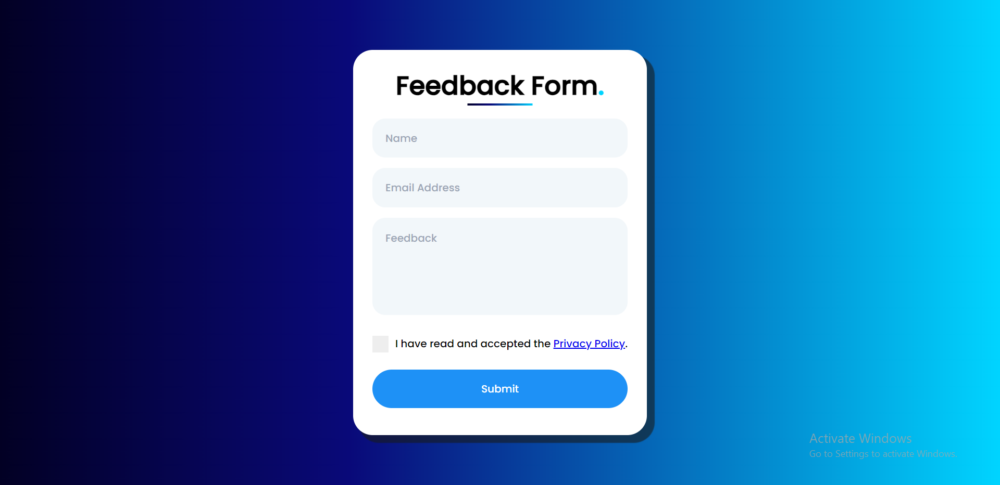

# Feedback Form Project

"Feedback Form Demo is a user-friendly web app. It uses React 18 for the front end, Node.js with Express for the back end, and the Notion API to store data."

## Table of Contents

- [Prerequisites](#prerequisites)
- [Getting Started](#getting-started)
  - [Installation](#installation)
  - [Configuration](#configuration)
  - [Starting the Application](#starting-the-application)
- [Usage](#usage)
- [Dependencies](#dependencies)
- [Contributing](#contributing)
- [License](#license)

## Prerequisites

Before you begin, ensure you have met the following requirements:

- Node.js and npm installed on your machine.
- A Notion account and an integration set up to access the Notion API.
- Basic knowledge of React, Node.js, and Express.

## Getting Started

### Installation

Clone this repository to your local machine:

```bash
git clone https://github.com/ircamitoc/feedback-form-demo.git
cd feedback-form-demo
```

Install the frontend dependencies

```bash
cd client-server
npm install axios react-toastify recaptcha
```

Install the backend dependencies

```bash
cd express_server
npm install express @notionhq/client cors body-parser
npm install express-rate-limit
npm install helmet
node server.js
```

### Configuration

1. Create a `.env` file in the `express_server` directory and set the following environment variables:

```
NOTION_API_KEY=YOUR_NOTION_API_KEY
NOTION_DATABASE_ID=YOUR_NOTION_DATABASE_ID
```

Replace `YOUR_NOTION_API_KEY` and `YOUR_NOTION_DATABASE_ID` with your actual Notion API key and database ID.

2. Configure the `client-server` by editing client-server/src/config.js:

```
const config = {
  RECAPTCHA_SITE_KEY: 'YOUR_RECAPTCHA_SITE_KEY',
};
```

Replace `YOUR_RECAPTCHA_SITE_KEY` with your actual reCAPTCHA site key.

### Starting the Application

Start the backend server:

```bash
cd ../express_server
node server.js
```

Start the frontend development server:

```bash
cd ../client-server
npm start
```

Visit `http://localhost:3000` in your browser to access the application.

# Usage

- The application provides a simple feedback form that allows users to submit feedback.
- Feedback submissions are stored in your Notion database.

# Dependencies

- Frontend:
  - **axios:** ^1.5.0
  - **react:** ^18.2.0
  - **react-dom:** ^18.2.0
  - **react-google-recaptcha:** ^3.1.0
  - **react-scripts:** 5.0.1
  - **react-toastify:** ^9.1.3
- Backend:
  - **express:** Latest version
  - **@notionhq/client:** Latest version
  - **cors:** Latest version
  - **body-parser:** Latest version
  - **express-rate-limit:** Latest version
  - **helmet:** Latest version

# Contributing

Contributions are welcome! Feel free to open issues or submit pull requests to help improve this project.

# License

This project is licensed under the GNU General Public License version 3.0 (GPL-3.0). See the [LICENSE](LICENSE) file for details.

Make sure to replace placeholders like `YOUR_NOTION_API_KEY`, `YOUR_NOTION_DATABASE_ID`, and `YOUR_RECAPTCHA_SITE_KEY` with your actual API keys and configuration. This README file provides detailed instructions for setup, configuration, and usage of your feedback form application.
